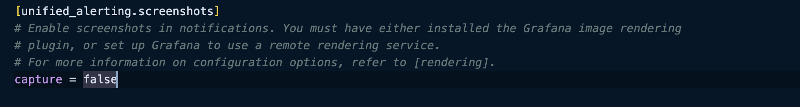

# Prometheus monitoring and image rendering


## Roles
- [x] [Grafana](#Grafana)
- [x] [Prometheus](#Prometheus)
- [x] [Node Exporter](#Node-Exsporter)
- [x] [Image Renderer](#Image-Renderer)


## Grafana

> [!IMPORTANT]  
> - Add your URL to `GF_SERVER_ROOT_URL` .
> - Don't forget to add your domain to `hostname` in traefik labels .


 
## Prometheus

- ### Add your domain to `hostname` in traefik labels if you want to access prometheus panel.
- ### Add your servers to 
```
  - job_name: 'job'
    static_configs:
      - targets: ['ip address:9100']

```

## Node Exporter

- ### You can use the node-exporter-only ansible to install it on servers you want to monitor.


> [!CAUTION]
> Don't forget to disable the roles you won't need in `setup.yml` file.

## Setup
```
python3 -m venv venv
source venv/bin/activate
pip install -r requirements.txt
```

## Run
Add ssh config hostname to `hosts`
```
ansible-playbook setup.yml
```

## Image Renderer

### If you want to activate Image Rendering to send real-time status check out  these precedures. 

```
docker exec -it grafana bash
cd grafana/conf/defaults.ini
```

- ### Use [Transfer.sh](https://transfer.sh/) to curl the defaults.ini file into your host system.
- ### Edit the file and change the capture value to true. [Doc](https://grafana.com/docs/grafana/latest/alerting/manage-notifications/images-in-notifications/#troubleshooting)

<p align="center">
    
</p>

- ### Save it in the root directory of your docker compose file.

 ```
 docker-compose down && docker-compose up -d 
 ```


